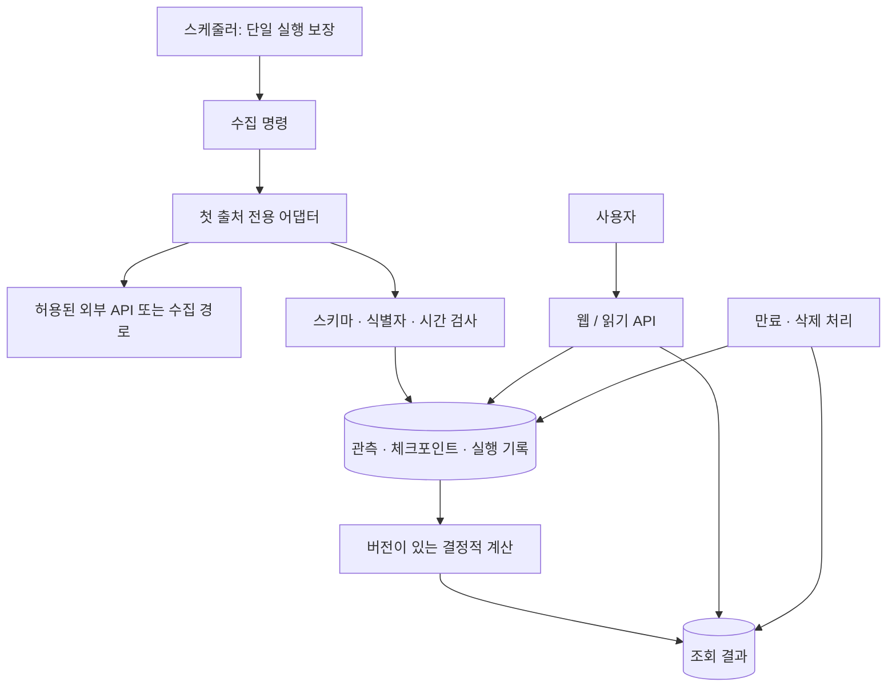

# 처리 구조와 운영 기본안

상태: 설계 기본안. 경로·명령·테이블은 제안이며 아직 구현되지 않았다. 실제 라이브러리 버전은 구현 시작 시 확인한다.

## 실행 구성

단일 코드베이스에서 웹 프로세스와 정기 수집 명령을 분리한다. PostgreSQL은 하나를 사용한다. 새 제품은 별도 저장소와 논리적으로 분리된 DB/자격증명을 우선 고려한다. 같은 서버를 쓰는지는 부하 측정과 비용 결정 후 정한다.



첫 운영은 한 수집 프로세스와 OS 수준 실행 잠금으로 충분한지 검증한다. 체크포인트와 실행 기록은 DB에 둔다. 웹 워커 시작 이벤트나 각 요청에서 스케줄러를 실행하지 않는다. 웹 프로세스 수를 늘려도 수집이 중복되지 않아야 한다.

## 코드 경계 제안

```text
<new-product-root>/
  app/
    web/               # HTML/읽기 API, 외부 출처 호출 없음
    collection/        # 첫 출처 어댑터, 작업 실행, 제한/재시도
    domain/            # 선택 분야의 식별자, 형식 변환, 지표 함수
    storage/           # SQLAlchemy 모델과 조회, 트랜잭션
    settings.py
    cli.py             # 수동 수집, 계산, 정리, 상태 확인
  templates/
  static/
  migrations/
  tests/fixtures/      # 합성 또는 사용 허가된 비식별 샘플
  docs/
```

폴더는 실제 코드가 생길 때 만든다. 빈 인터페이스와 플러그인 프레임워크를 선행 구현하지 않는다. 첫 어댑터는 한 출처에 명시적으로 맞춘다. 다른 출처 추가가 실제로 필요해질 때 공통 부분을 추출한다.

FastAPI·PostgreSQL·Alembic·서버 렌더링을 기본안으로 사용한다. 기존 서비스의 ML 패키지나 게임 코드는 새 제품의 기본 의존성이 아니다. 검색은 작은 범위에서 DB 조회로 시작하고 실제 느린 쿼리를 확인한 뒤 개선한다.

## 저장할 논리적 정보

| 단위 | 필요한 내용 | 경계 |
|---|---|---|
| 출처 정의 | 코드, 공식 문서, 수집 허용 범위, 갱신/보관 설정, 상태 | 비밀 키는 설정 밖 별도 비밀 저장소/환경 변수 |
| 수집 대상 | 내부 ID, 출처의 안정 ID, 표기명, URL, 활성/삭제 상태 | 이름 변경은 동일 대상으로 유지; 이름만 보고 병합하지 않음 |
| 수집 실행 | 실행 ID, 예정 수집 시각, 시작/종료, 시도 수, 사용량, 체크포인트, 결과 | 실패와 정상적인 빈 응답을 구분 |
| 관측 | 대상, 기준 시각/기간, 관측 수치, 단위, 품질, 수집 실행, 만료 | 출처 정책에 따라 정정·삭제 가능; 무기한 불변 로그 아님 |
| 계산 결과 | 지표 버전, 입력 범위/관측 참조, 결과, 계산 시각, 품질 | 원본 관측을 덮어쓰지 않음; 입력 만료/삭제에 종속 |

이 구분을 그대로 다섯 개의 범용 테이블로 구현하라는 뜻은 아니다. 분야 선택 후 관측은 타입이 있는 명시적 컬럼/테이블로 설계한다. 모든 필드를 문자열 key/value나 JSON 한 덩어리에 넣는 범용 스키마는 기본안이 아니다. 유연한 원문 메타데이터만 필요한 범위에서 JSON을 고려한다.

## 한 번의 수집

1. 출처 활성 상태, 요청·비용 한도, 실행 잠금을 확인한다. 한도와 정책이 미정인 출처는 예약 수집하지 않는다.
2. 실행 기록을 만들고 고정된 대상/페이지 범위를 읽는다. 같은 작업의 재시도는 같은 예정 수집 구간과 작업 식별자를 사용한다.
3. 제한된 시간과 응답 크기로 외부 요청을 수행한다. 서버가 제공한 재시도 간격과 쿼터를 준수한다.
4. 응답 형식과 의미를 검증한다. 오류 HTML이나 접근 제한 페이지를 정상 데이터로 저장하지 않는다.
5. 한 페이지 또는 작은 배치의 관측과 체크포인트를 같은 DB 트랜잭션에서 확정한다. 확정 전에 다음 페이지로 진행한 것으로 기록하지 않는다.
6. 실패는 정해진 횟수 내에서만 재시도한다. 중간 실패 시 이미 확정한 범위는 보존하고 실행 상태는 `partial`로 남긴다.
7. 유효 관측을 기준으로 계산한다. 계산 완료된 범위만 공개 조회 결과로 교체한다. 실패로 기존 유효 결과를 0이나 빈 값으로 덮지 않는다.
8. 사용량·성공 수·누락·오류와 마지막 성공 시각을 남긴다. 인증 헤더와 원문 개인정보는 로그에 남기지 않는다.

증분 커서가 없는 출처는 제한된 재조회 범위를 사용한다. 중복 제거가 먼저 있어야 한다. 커서 무효·페이지 순서 변경·부분 응답 처리 방식은 출처별로 명세한다. 미래에 실패한 구간을 복구할 수 없는 출처라면 결측 기간을 그대로 보존한다.

## 장애와 복구

| 상황 | 처리 | 금지 |
|---|---|---|
| 429/일시 장애 | 대기 지침, 제한된 지수 지연, 요청 예산 안에서 재시도 | 무한 재시도, 키/계정/IP 교대로 제한 회피 |
| 인증/권한 실패 | 해당 출처 작업을 멈추고 상태 기록 | 전체 출처로 오류 확산, 크롤링으로 자동 우회 |
| 응답 스키마 변경 | 영향받은 배치 격리, 실패 관측 기록, 이전 유효 결과 유지 | 누락 필드에 0을 넣어 성공 처리 |
| 중복 실행/중간 종료 | 실행 잠금 + 재실행 중복 방지 + 확정된 체크포인트에서 재개 | 완료되지 않은 작업을 완료로 기록 |
| 실제 대상 삭제/권한 철회 | 출처 규칙대로 공개 중단·삭제·파생 결과 무효화 | 단순 일시 실패를 삭제로 간주하거나 삭제 자료를 stale로 제공 |
| 계산 오류 | 입력과 버전 확인, 해당 결과만 교체 중단 | 모든 결과를 한 번에 제거 |

부분 수집 결과로 전체 순위를 새로 발표하지 않는다. 첫 버전에서 순위를 구현한다면 대상별 신선도·제외 기준을 만족한 완결된 결과 묶음으로 교체한다. 비교도 동일 기준을 만족하지 않으면 제한을 표시한다.

## 보관과 삭제

- 원문 전체 저장은 기본적으로 꺼 둔다. 허용된 필드만 관측 형태로 보관한다. 디버깅용 원문이 필요하면 허용 필드, 목적, 짧은 만료와 접근 범위를 출처별로 정한다.
- 정책상 만료·삭제는 관측, 대상 메타데이터, 계산 결과, 캐시, 내보내기 파일까지 적용한다. 나중에 생긴 저장 경로도 목록에 추가한다.
- 계산 결과의 공개 가능 기한은 원천 데이터의 규칙을 초과하지 않는다. 입력이 삭제되면 결과를 무효화하거나 규칙에 맞게 다시 계산한다.
- 삭제 작업이 늦어져도 읽기 경로는 만료/공개 제한 데이터를 제외한다. 물리 삭제를 미룰 근거로 삼지 않는다.
- 재수집·백업 복원으로 삭제한 값이 되살아나지 않도록 허용 범위의 삭제 상태를 유지하고 복구 전에 적용한다. 백업 주기·만료와 삭제 요청 처리 방법도 출처별 정책에 맞춘다.
- 단순히 `is_deleted`만 붙이거나 해시를 남겼다고 삭제 의무를 충족했다고 가정하지 않는다.

## 비용과 크기 계산

숫자는 목표나 약속이 아니라 `DOMAIN.md`에 채울 변수다.

```text
하루 요청 수 ≈ ceil(대상 수 N / 요청당 대상 수 B) × 하루 갱신 F × 대상당 추가 요청 K
              + 목록 탐색/페이지 조회 + 제한된 재시도
하루 쿼터 = 각 엔드포인트 요청 수 × 해당 엔드포인트 쿼터 단위의 합
스냅샷 행 수 ≈ N × F × 보관 일수 D   # 여러 지표를 같은 행에 둘 때
보관 비용 = 실제 행/인덱스 크기 + 허용 원문 + 백업 + 로그
총 월 비용 = 서버 + DB/저장 + 백업 + 외부 API/라이선스 + 트래픽 + 선택한 부가 기능
```

예시일 뿐: 대상 1,000개를 하루 한 번 365일 기록하면 대상별 스냅샷은 약 365,000행이다. 출처가 365일 보관을 허용한다는 뜻도, 실제 디스크 크기를 의미하는 것도 아니다. 지표를 행으로 나눴다면 지표 수를 추가로 곱해야 한다.

콜 수와 쿼터 단위는 다를 수 있다. 예약 수집에는 출처별 일일 한도·동시성·타임아웃·최대 페이지·최대 재시도를 설정한다. 비용 한도 초과 시 수집을 보류하고 기존 데이터의 노후화를 표시한다. 문서 예시값을 실제 제한값으로 복사하지 않는다.

현재 saerong 서버의 저부하 관측은 새 서비스 수용량의 증거가 아니다. TDM 모델 로드·수집·가공이 겹칠 때의 메모리와 CPU, 디스크 증가를 별도로 확인한다. 새 인프라 구매나 서버 축소는 이 기획으로 실행하지 않는다.

## 관측 가능성과 공개 준비

첫 단계부터 수집 성공/실패/부분 성공, 마지막 유효 데이터 시각, 신선도 충족률, 거부/결측 수, 출처별 요청/쿼터, 실행 시간, 저장량을 기록한다. 페이지 방문 수를 데이터 품질 지표 대신 쓰지 않는다.

개발/시험 DB는 운영과 분리한다. 비밀값 없는 fixture로 중복·결측·정정·삭제를 검증한다. 라이브 API 시험은 읽기만 수행하며 제한된 대상과 예산을 먼저 고정한다. 공개 전에는 백업 복구, 수집 중단, 결과 되돌리기, 인증/호스트 제한을 실제 환경에 맞게 검증한다.

운영용 명령·서비스 파일·정확한 배포 순서는 배포 대상 결정 후 작성한다. 지금 있는 `deploy/README.md`를 새 제품의 배포 명세로 사용하지 않는다.

## 입력과 공개 데이터 경계

URL 입력이 필요하면 허용한 공급자 URL에서 안정 ID만 추출한다. 사용자가 준 임의 주소를 서버가 방문하지 않는다. 출처 호스트/리다이렉트/응답 크기를 제한하고, 외부 문자열은 HTML로 신뢰하지 않는다. 공개 API는 읽기 전용으로 시작하며 운영 수집·삭제 명령은 공개 라우트로 노출하지 않는다.

## 확장 판단

느린 검색은 먼저 실행 계획과 인덱스를 확인한다. 작업이 갱신 간격을 넘으면 요청 묶음·대상 우선순위·주기를 점검한다. 이후에만 추가 워커나 큐를 검토한다. 두 번째 분야는 첫 분야에서 재사용할 경계가 확인된 뒤 추가한다. 이 문서가 모든 분야를 처리하는 프레임워크 구축 지시는 아니다.
