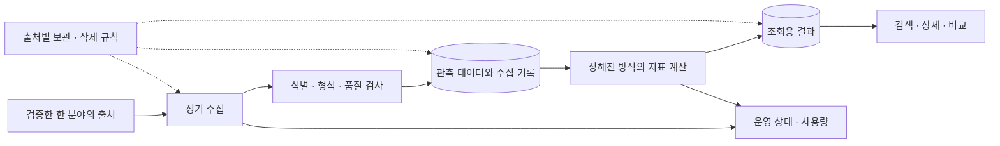

# 한 분야 데이터 분석 서비스 — 기획 패키지

> **비활성 참고 문서 (2026-09-29):** 새 제품 방향은 아키네이터 방식의 AI 무당이다. 이 폴더 전체의 명세·작업 목록·모델 인계 프롬프트는 과거 데이터 서비스 제안에만 해당한다. 현재 작업은 [AI 무당 기획·인계](../ai-shaman/README.md)를 따른다. 아래 내용은 당시 기록이며 현재 구현 지시가 아니다.

작성: 2026-09-29 · 상태: 공통 설계 초안 / 첫 분야 미정 / 제품 코드 없음

## 목적

한 분야의 데이터를 지속적으로 수집·저장·정리하여 검색, 대상별 이력, 조건에 맞는 비교를 제공한다. 블링·녹스의 데이터 조회/분석 서비스 형태를 참고하되, 유튜브나 수익 계산기를 첫 제품으로 확정한 것은 아니다.

사용자는 설계와 어려운 판단에 높은 성능의 모델을 사용하고, 범위가 정해진 구현은 비용이 낮은 모델로 이어가기를 원한다. 이 문서는 그 인계를 위한 작업 기준이다. 문서를 많이 읽게 하는 대신, 작업마다 필요한 명세와 완료 조건을 제공한다.

## 현재 확정과 미정

| 구분 | 내용 |
|---|---|
| 사용자 확정 | 먼저 한 분야를 깊게 다룬다. 데이터를 축적하고 가공해서 가치를 제공한다. 현재는 전체 구조와 에이전트 인계 기준을 만든다. |
| 설계 기본안 | 작은 단일 애플리케이션 + 별도 수집 프로세스 + PostgreSQL. 화면 요청 중 외부 데이터를 수집하지 않는다. |
| 아직 미정 | 첫 분야, 첫 사용자, 핵심 질문, 실제 출처, 활용/보관 조건, 지표, 월 예산, 제품 저장소와 배포 위치 |
| 이번 작업 범위 | 기획과 명세 작성. 운영 서버 변경, 신규 과금 리소스 생성, 대량 수집, 앱 구현은 포함하지 않는다. |

설계 기본안은 변경 근거가 있으면 조정한다. 사용자 결정으로 표현하지 않는다. 과거 대화의 후보는 검토 이력이며 제품 요구사항이 아니다.

## 구조 한눈에 보기

사용자는 저장된 결과를 본다. 외부 출처가 느리거나 끊겨도 사이트는 마지막 유효 데이터와 그 시각을 정직하게 보여준다. 삭제·이용 제한·보관기한 만료 데이터는 이 예외에 포함하지 않는다.

## 문서 안내

| 문서 | 읽는 상황 | 담당 내용 |
|---|---|---|
| [PRODUCT](PRODUCT.md) | 제품 방향과 화면 범위 | 사용자 가치, 첫 출시 범위, 판단 기준 |
| [ARCHITECTURE](ARCHITECTURE.md) | 수집·저장·API 구현 | 모듈 경계, 처리 흐름, 운영·비용 |
| [DATA_CONTRACT](DATA_CONTRACT.md) | 데이터·지표·화면 구현 | 식별자, 시간, 결측, 계산, 응답 의미 |
| [DOMAIN](DOMAIN.md) | 첫 분야 결정 및 조사 | 채워야 할 분야별 명세와 출처 검증 |
| [TASKS](TASKS.md) | 실제 작업 선택 | 의존성, 작업 범위, 완료 조건 |
| [MODEL_WORKFLOW](MODEL_WORKFLOW.md) | 모델 전환·인계 | 작업별 역할, 전달 프롬프트, 실패 대응 |
| [DECISIONS](DECISIONS.md) | 설계를 바꾸려 할 때 | 확정 사항, 기본안, 열린 결정 |
| [STATUS](STATUS.md) | 매 작업 시작·종료 | 구현 현황, 검증 근거, 다음 작업 |
| [SOURCES](SOURCES.md) | 외부 사실 재확인 | 공식 문서와 확인 범위 |

일반 구현 모델의 시작 읽기: 루트 `AGENTS.md` → 이 문서 → `STATUS.md` → 지정 작업 → 관련 명세. 모든 문서를 매번 재독하지 않는다.

## 다음 결정

첫 분야와 첫 사용자가 정해지면 [DOMAIN](DOMAIN.md)을 채워 실제 출처와 핵심 질문이 맞물리는지 확인한다. 출처가 제공하지 않는 값으로 기능을 약속하지 않는다. 분야 미정 상태에서 범용 수집기를 먼저 구현하지 않는다.

## 새 저장소로 옮길 때

현재 저장소는 기존 saerong 서비스의 운영 코드가 있다. 별도 제품 저장소를 우선 제안하지만 생성하지 않았다. 이동할 경우 이 문서 묶음과 새 제품에 해당하는 에이전트 규칙을 옮기고, 기존 서비스의 경로·배포 지침은 가져가지 않는다. 링크와 실행 명령은 새 루트 기준으로 다시 검증한다.
